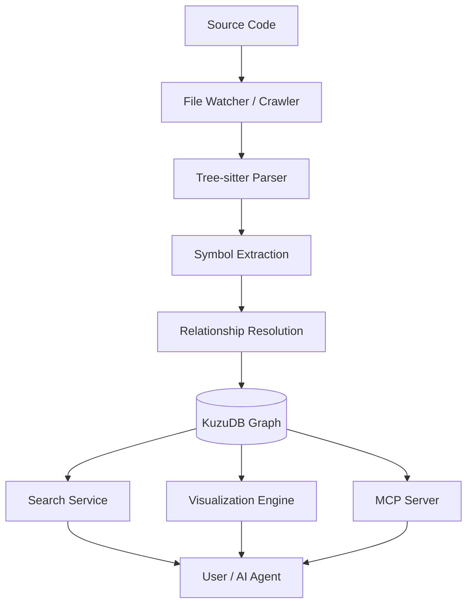

# GraphHub System Architecture

## Overview
GraphHub is a local-first code intelligence platform that transforms source code into a queryable knowledge graph.

## Pipeline Flow

## Key Components

### 1. Ingestion Engine (`/src/services/ingestion`)
- **Parser**: Uses Tree-sitter to generate ASTs.
- **Resolver**: Maps imports and calls across files to establish edges in the graph.
- **Workers**: Uses Web Workers or Worker Threads to prevent UI blocking during large repo indexing.

### 2. Knowledge Graph (`/src/services/db`)
- **Schema**: Defines Node types (File, Class, Function, Interface, Variable) and Edge types (Imports, Calls, Inherits, References).
- **Embedded DB**: KuzuDB instance (Native or WASM).

### 3. Integration Layer (`/src/services/mcp`)
- **MCP Server**: Implements the Model Context Protocol.
- **Tools**: `query`, `get_context`, `impact_analysis`.

### 4. UI Layer (`/src/components`)
- **Graph View**: Interactive D3-based force-directed graph.
- **Symbol Detail**: Sidebar showing metadata and relationships for selected nodes.
- **Search Bar**: Hybrid search input.

## Data Privacy
- All data remains on the user's machine (Local Storage / IndexedDB).
- No code is sent to external servers for indexing.
